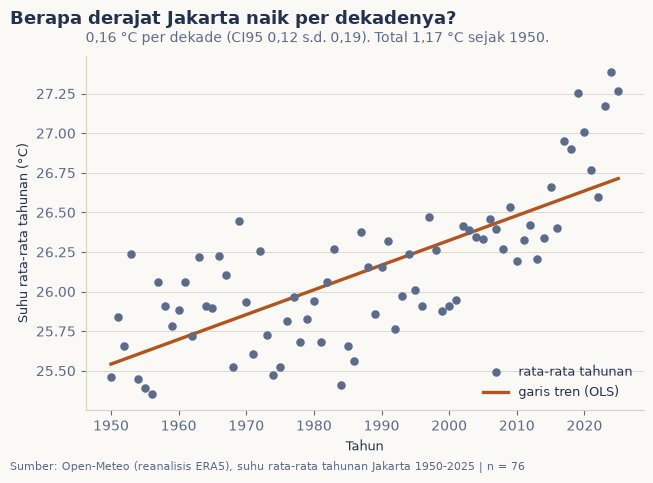
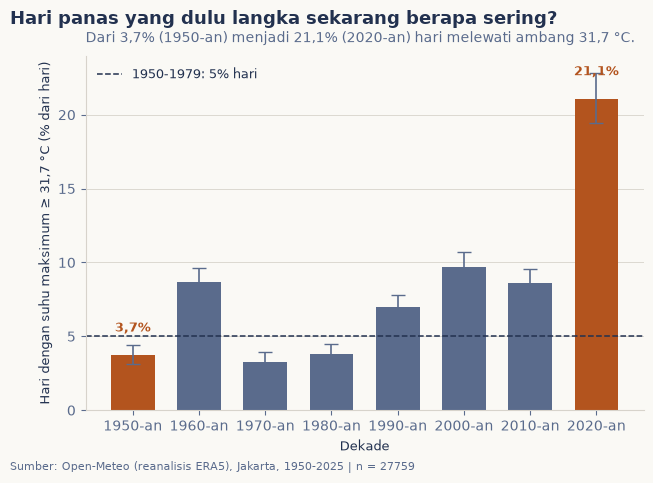

# Jakarta benar makin panas, atau kita saja yang mengeluh?

Setiap tahun menjelang kemarau, keluhan yang sama muncul di linimasa: katanya Jakarta makin panas. Katanya. Saya termasuk yang rajin mengeluh itu, jadi kali ini saya bawa datanya: 76 tahun suhu harian Jakarta, dari 1950 sampai 2025. Sebelum kita ikut-ikutan mengeluh, tebak dulu: kira-kira berapa derajat naiknya, dan apakah keluhan itu benar?

## Data & cara ukur

Yang diukur: suhu udara harian (maksimum, minimum, rata-rata) di titik Jakarta Pusat dari Open-Meteo Historical Weather API (reanalisis ERA5), 28.024 hari dari 1 Januari 1950 sampai 22 September 2026. Analisis memakai 76 tahun penuh, 1950 sampai 2025, karena 2026 masih berjalan. Hasil uji kelayakan sumber: BMKG saya datangi lebih dulu, tapi data iklim historisnya hanya terbuka lewat akun dan API key. Sebagai pembanding dipakai NASA POWER (MERRA-2) sejak 1984.

Yang hilang dari cara ukur ini, sejak awal: reanalisis itu campuran model dan pengamatan, bukan sensor stasiun. Resolusi gridnya kasar, jadi panas kota mungkin tidak tertangkap penuh.

## Pembedahan 1: berapa derajat per dekadenya?

Cara paling sederhana: hitung satu angka suhu rata-rata untuk tiap tahun, lalu beri garis tren. Regresi linier (OLS) menghasilkan kenaikan **0,16 °C per dekade** (0,12 s.d. 0,19; p < 0,001), atau total **1,17 °C** sepanjang 1950-2025. Garis tren gampang tergoda satu tahun yang aneh, jadi saya ulang dengan Theil-Sen (median laju kenaikan dari semua pasangan tahun, tahan terhadap pencilan): hasilnya nyaris menimpa, 0,15 °C per dekade (0,12 s.d. 0,19). Uji Kendall yang tidak mensyaratkan bentuk distribusi juga setuju (tau = 0,56; p < 0,001).

Sebagai ukuran efek yang enak dibayangkan, saya bandingkan dua jendela 20 tahun: rata-rata tahunan naik **0,82 °C** (0,59 s.d. 1,04) dari 25,86 °C (1950-1969) ke 26,68 °C (2006-2025), dengan Cohen's d 2,33. Angka d sebesar itu jarang-jarang; sekali pun Anda tidak hafal skalanya, artinya dua jendela itu nyaris tidak tumpang tindih.



## Pembedahan 2: hari-hari panas yang dulu langka

Rata-rata bisa menyembunyikan yang paling terasa: hari-hari kepanasan. Saya pakai ambang **31,7 °C** untuk suhu maksimum harian, yaitu persentil ke-95 dari era dasar 1950-1979 (dulu, hanya 5% hari yang melewatinya). Lalu saya hitung berapa persen hari tiap dekade yang melewatinya, lengkap dengan interval kepercayaan Wilson-nya.

Jalannya tidak mulus: 1960-an sempat melompat ke 8,7%, 1970-an anjlok ke 3,3%. Tapi ujung ceritanya sulit disangkal. Dekade 2020-an mencatat **21,1%** hari (19,4 s.d. 22,8) di atas ambang, dan dibandingkan periode 2010-2025 dengan 1950-1959, hari segitu muncul **3,6 kali lebih sering** (3,0 s.d. 4,3; 13,3% vs 3,7%; uji proporsi z = 15,4; p < 0,001). Dulu 4 hari dari seratus, sekarang 13.



## Uji silang: satu produk lagi, arah yang sama

Sebelum angka-angka ini keluar jurnal, saya bawa ke NASA POWER, produk lain (MERRA-2) yang cara buatnya berbeda dari ERA5. Untuk jendela sama 1984-2025, NASA POWER menghasilkan laju 0,19 °C per dekade (p < 0,001), sementara ERA5 pada jendela itu 0,31 °C per dekade. Dua produk sepakat soal arah dan kepastiannya, tapi berbeda soal besaran. Karena itu klaimnya hanya di level "naik", bukan "naik persis sekian".

## Temuan

> **Benar makin panas: rata-rata suhu Jakarta naik 1,17 °C sejak 1950, dan hari panas yang dulu langka sekarang muncul 3,6 kali lebih sering.**

Naiknya bukan desas-desus: 0,16 °C per dekade (CI95% 0,12 s.d. 0,19) dengan tiga cara hitung yang saling menguatkan, dan sinyal hari ekstremnya lebih nyaring daripada sinyal rata-ratanya. Bonus untuk yang suka melihat kalender: bulan terpanas Jakarta ternyata Oktober (26,83 °C), bukan Juli yang sering disangka; dan hari paling panas di seluruh rekaman ada di 7 September 2024 (maksimum 35,8 °C), belum lama ini.

## Batas & cara reproduksi

Yang tidak boleh disimpulkan dari edisi ini: penyebab pemanasannya. Tren ini bercampur antara sinyal iklim global, panas kota (urban heat island), dan perubahan tutupan lahan; mengaitkannya pada satu penyebab butuh penelitian sendiri. Data adalah reanalisis berskala kasar, bukan sensor stasiun BMKG, dan hanya satu titik grid untuk seluruh Jakarta. Edisi 012 (Agustus 2027) dijadwalkan mengulang hitungan ini dengan tambahan dua tahun data.

```bash
python3 tools/data_scraping.py
python3 -m nbconvert --to notebook --execute --inplace analisis.ipynb
```

## Sumber Data

- Open-Meteo Historical Weather API (reanalisis ERA5), titik -6,18 / 106,83, diakses 22 September 2026.
- NASA POWER (MERRA-2), titik yang sama, diakses 22 September 2026.
- Data olahan: `data/suhu-harian-jakarta.csv`. Kode pengambilan: `tools/data_scraping.py`.
- Data mentah apa adanya: `data/mentah/`.
