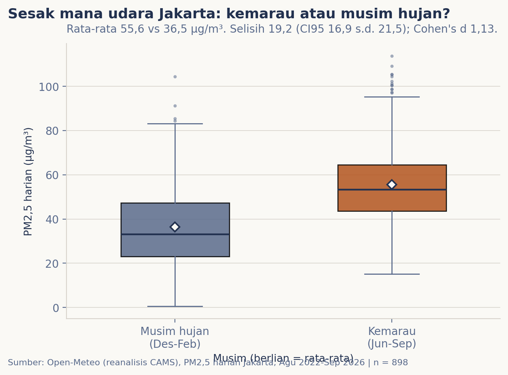
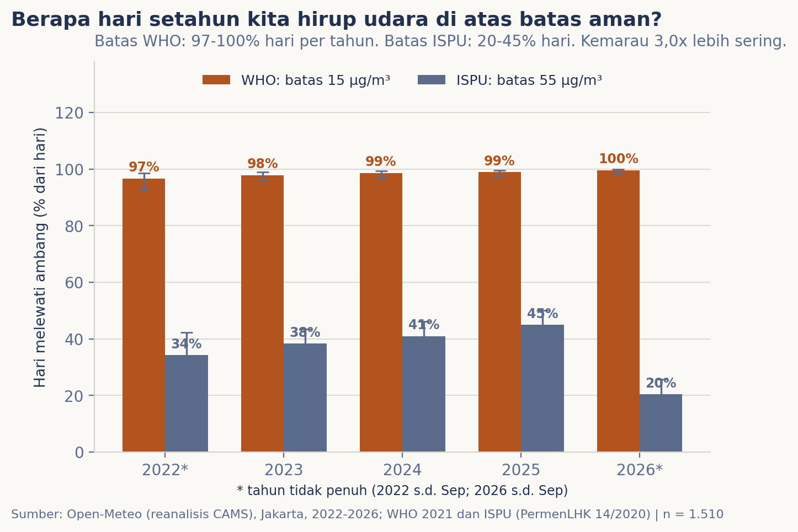

# Sesak mana udara Jakarta: kemarau atau musim hujan?

**Rubrik:** Kota | **Terbit:** Oktober 2026 | **Sumber utama:** Open-Meteo Air Quality (reanalisis CAMS) | **Waktu baca:** ±4 menit

Tiap kemarau, keluhan "sesak napas" dan "udara kotor" membanjiri linimasa. Sebelum percaya, saya
ukur sendiri: 1.510 hari PM2,5 di Jakarta dari Agustus 2022 sampai September 2026, lalu tiap
hari saya tandai masuk kemarau atau musim hujan. Seberapa besar bedanya, dan seberapa sering
kita sebenarnya menghirup udara di atas batas aman?

## Data & cara ukur

Yang diukur: partikel halus PM2,5 (berukuran 2,5 mikrometer ke bawah) per jam di titik Jakarta
Pusat dari Open-Meteo Air Quality API (reanalisis CAMS), dirangkum jadi rata-rata harian dengan
syarat minimal 18 jam terisi per hari mengikuti kaidah WHO. Hasilnya 1.510 hari sah dari 5
Agustus 2022 sampai 22 September 2026. Musim ditandai klimatologis: kemarau Juni-September,
musim hujan Desember-Februari, sisanya pancaroba yang dikeluarkan dari perbandingan. Sebagai
verifikasi, curah hujan harian ERA5 memang rata-rata 3,3 mm per hari saat kemarau melawan 9,5
mm saat musim hujan.

Uji kelayakan sumber mencatat siapa yang gugur: ISPU BMKG butuh akun (jalur publiknya 404),
OpenAQ butuh API key, NASA POWER tidak punya PM2,5. Yang lulus hanya CAMS, dan batasnya saya
catat sejak awal: CAMS itu model reanalisis, bukan stasiun ISPU. Resolusi gridnya kasar dan
datanya baru empat tahun, cukup untuk membandingkan musim, tidak untuk tren panjang.

## Pembedahan 1: seberapa jauh jarak dua musimnya?

Ukuran paling sederhana: bandingkan rata-rata PM2,5 harian kemarau (537 hari) dengan musim hujan
(361 hari). Kemarau **55,6 µg/m³**, musim hujan **36,5 µg/m³**. Selisihnya **19,2 µg/m³**
(CI95% 16,9 s.d. 21,5; uji Welch, p < 0,001). Uji Welch dipilih karena dua musim tidak
diwajibkan punya sebaran yang sama besar.

Yang lebih enak dibayangkan adalah Cohen's d: selisih dua rata-rata dalam satuan simpangan
baku. Nilainya **1,13**, artinya rata-rata kemarau berdiri lebih dari satu simpangan baku di
atas rata-rata musim hujan. Dua sebarannya masih tumpang tindih, tapi pusatnya bergeser jelas.



Dua temuan kecil untuk warna: bulan paling kotor ternyata Mei (64,6 µg/m³), awal kemarau, bukan
puncak Agustus; dan hari paling sesak tercatat 23 Mei 2023 (128,5 µg/m³).

## Pembedahan 2: berapa hari di atas batas aman?

Di sini hasilnya bergantung pada siapa yang memegang penggaris. Pedoman WHO 2021 menetapkan
batas aman PM2,5 24 jam pada **15 µg/m³**; baku mutu nasional lewat ISPU (PermenLHK 14/2020)
memakai **55 µg/m³**, hampir empat kali lebih longgar. Saya hitung dua-duanya, lengkap dengan
interval kepercayaan Wilson.

Menurut batas WHO, nyaris tidak ada hari aman: 97% sampai 100% hari tiap tahun melewatinya, di
kedua musim sekaligus. Menurut batas ISPU, angkanya 20% sampai 45% hari per tahun, dan di
sinilah musimnya terasa: hari di atas 55 µg/m³ muncul **3,0 kali lebih sering** saat kemarau
(44% melawan 15%; CI95% 2,3 s.d. 3,8; uji proporsi z = 9,2; p < 0,001). Menariknya, batas
bawah kategori "sedang" ISPU (15,5 µg/m³) nyaris sama dengan batas WHO. "Buruk atau tidaknya"
udara Jakarta jadi pertanyaan tentang siapa yang memegang penggarisnya.



## Uji kekokohan

Sumber pembanding kedua untuk PM2,5 tidak ditemukan saat uji kelayakan, jadi yang diuji di sini
bukan silang sumber, melainkan kekokohan terhadap pilihan analisis. Pertama, uji Mann-Whitney
yang tidak berasumsi sebaran normal memberi p < 0,001, sama kuatnya dengan Welch. Kedua, 2022
dan 2026 yang tidak penuh saya buang; selisihnya justru melebar ke 21,6 µg/m³ (d = 1,22).
Kesimpulan "kemarau lebih sesak" tidak bergantung pada dua pilihan itu.

## Temuan

> **Benar: udara Jakarta lebih sesak saat kemarau, dengan PM2,5 19,2 µg/m³ lebih tinggi dari
> musim hujan dan hari melewati batas ISPU 3,0 kali lebih sering.**

Ukuran efeknya besar (Cohen's d 1,13) dan kokoh di tiga cara hitung berbeda. Tapi temuan yang
paling menohok justru soal garis batas: menurut pedoman WHO, 97% sampai 100% hari di Jakarta,
musim apa pun, termasuk tidak aman. Baku mutu nasional yang hampir empat kali lebih longgar
membuat masalah yang sama terlihat jauh lebih kecil.

## Batas & cara reproduksi

Yang tidak boleh disimpulkan dari edisi ini: penyebab dan sumber polusinya. Asap kendaraan,
industri, pembakaran lahan, dan arah angin semuanya bercampur; menguraikannya butuh data emisi
dan penelitian sendiri. Yang juga harus diingat: CAMS reanalisis bukan stasiun ISPU BMKG,
gridnya kasar, hanya satu titik untuk seluruh Jakarta, dan jendelanya baru empat tahun. Angka
2026 yang lebih rendah sebagian karena datanya berhenti di September, belum melewati Oktober
yang kotor.

```bash
python3 unduh_data.py
python3 -m nbconvert --to notebook --execute --inplace analisis.ipynb
```

## Kaki sumber

- Open-Meteo Air Quality API (reanalisis CAMS), titik -6,18 / 106,83, diakses 22 September 2026.
- Open-Meteo Historical Weather API (ERA5) untuk verifikasi curah hujan, diakses 22 September 2026.
- Pedoman kualitas udara WHO 2021 (PM2,5 24 jam = 15 µg/m³); baku mutu ISPU, PermenLHK No. 14 Tahun 2020 (PM2,5 24 jam = 55 µg/m³).
- Data olahan: `data/udara-harian-jakarta.csv`. Kode pengambilan: `unduh_data.py`.
- Data mentah apa adanya: `data/mentah/`.
