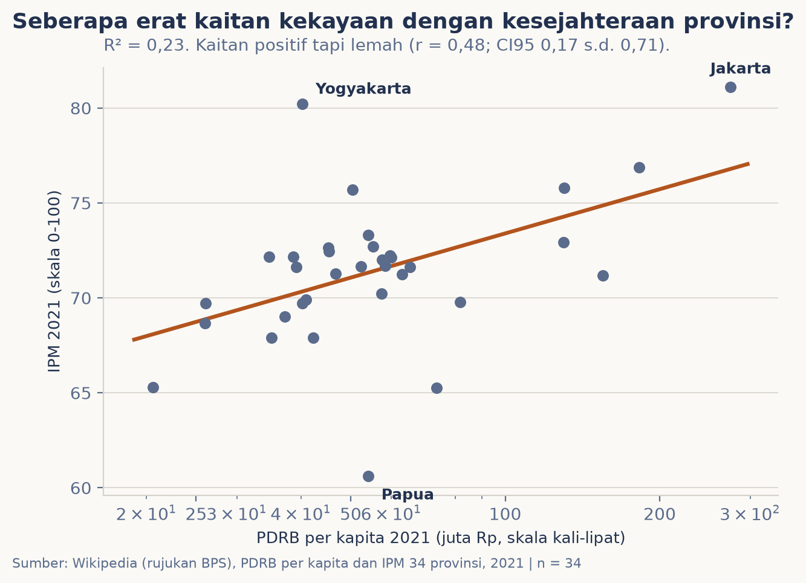
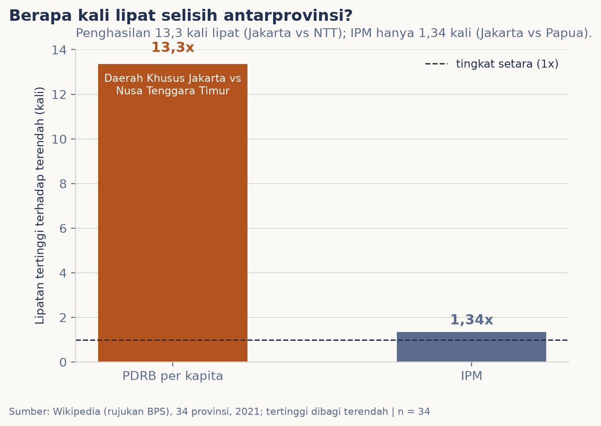

# Provinsi makin kaya, warganya makin sejahtera?

Kalimat itu sering terlontar apa adanya: provinsi yang kaya, pasti warganya sejahtera. Rakyat makmur. Sebelum percaya, saya bawa angkanya: PDRB per kapita dan Indeks Pembangunan Manusia (IPM) untuk 34 provinsi di tahun 2021. Seberapa erat kaitan keduanya, dan seberapa jauh sebenarnya selisih antarprovinsi itu?

## Data & cara ukur

Yang diukur, dua angka untuk tiap provinsi di 2021. **PDRB per kapita**: nilai seluruh barang dan jasa yang dihasilkan satu provinsi dalam setahun, dibagi jumlah penduduknya, dalam juta rupiah. **IPM**: indeks 0-100 gabungan umur panjang, lama sekolah, dan daya beli, ukuran resmi "sejahtera" versi BPS. Pasangannya sengaja satu tahun yang sama supaya adil.

Uji kelayakan sumber: situs BPS memblokir akses otomatis (403), jadi yang lulus adalah tabel Wikipedia bahasa Indonesia (CC BY-SA) yang merujuk BPS; mentahnya disimpan apa adanya untuk diaudit. Yang hilang sejak awal: ini data agregat provinsi. PDRB per kapita bukan gaji, dan 2021 adalah tahun terakhir yang punya PDRB per kapita di sumber ini,
sebelum empat provinsi Papua dimekarkan.

## Pembedahan 1: seberapa erat kaitannya?

Alat pikir edisi ini: **korelasi** dan **R²**. Korelasi Pearson (r) mengukur seberapa erat dua hal berjalan bersama, dari -1 (berlawanan sempurna) sampai 1 (sejalan sempurna). R² menerjemahkannya: berapa banyak keragaman satu hal yang bisa dijelaskan yang lain, dalam skala 0 sampai 100 persen.

Di sini r = **0,48** (CI95% 0,17 s.d. 0,71; p = 0,002) dengan R² = **0,23**. Artinya kaitannya positif tapi lemah: penghasilan daerah hanya menjelaskan **23%** keragaman kesejahteraan; 77% sisanya dijelaskan hal lain. Sumbu penghasilan memakai skala kali-lipat, setiap langkah sama berarti kali lipat, bukan tambah tetap, karena Jakarta begitu jauh di depan.

Titik-titik yang menjauh dari garis justru ceritanya: **Yogyakarta** dengan PDRB per kapita cuma 40,2 juta (di bawah rata-rata) justru IPM-nya 80,2, peringkat dua nasional, 9,8 poin di atas dugaan garis. Di ujung lain, **Papua** 10,3 poin di bawah dugaan.



## Pembedahan 2: berapa kali lipat selisihnya?

Korelasi bicara kekaitan; bagian ini bicara jarak. Ujung ke ujung, PDRB per kapita **13,3 kali lipat**: Jakarta 274,7 juta per orang per tahun melawan Nusa Tenggara Timur 20,6 juta. IPM? Hanya **1,34 kali lipat**: Jakarta 81,11 melawan Papua 60,62.

Perhatikan beda kedua lipatan itu. Keuangan daerah berjauhan sekali; hasil pembangunan yang diukur umur panjang, sekolah, dan daya beli ternyata jauh lebih merata. Kaya memang enak, tapi angkanya bilang: kaya tidak otomatis menjamin sejahtera, dan tidak kaya tidak otomatis berarti tertinggal jauh.



## Uji kekokohan

Karena BPS tidak punya API terbuka, silang sumber tidak mungkin; yang diuji adalah kekokohan terhadap pilihan cara hitung. Pertama, korelasi dihitung ulang di skala lurus (tambah juta, bukan kali lipat): r = 0,52 (CI95% 0,22 s.d. 0,73). Kedua, uji Spearman yang hanya memakai peringkat, tanpa asumsi bentuk hubungan: rho = 0,38 (p = 0,03). Ketiganya berbeda angka tapi sepakat soal kesimpulan: kaitan kekayaan dan kesejahteraan itu nyata namun lemah, dan selalu banyak pengecualian.

## Temuan

> **Kaitan ada tapi lemah: kekayaan daerah hanya menjelaskan 23% keragaman kesejahteraan, dan selisih penghasilan antarprovinsi 13,3 kali lipat sementara selisih IPM hanya 1,34 kali lipat.**

Kalimat "provinsi kaya pasti sejahtera" tidak salah sepenuhnya, hanya jauh lebih lemah dari yang dibayangkan. Sisanya kelihatan dari para pengecualian: Yogyakarta dengan PDRB per kapita 40,2 juta menempati peringkat dua IPM nasional; Papua, walau penghasilannya setara banyak provinsi lain, IPM-nya 10,3 poin di bawah dugaan.

## Batas & cara reproduksi

Yang tidak boleh disimpulkan: penyebabnya, dan kantong siapa yang tebal. PDRB per kapita adalah output daerah per orang, bukan pendapatan warga; provinsi migas contohnya bisa sangat kaya angkanya tanpa otomatis IPM tinggi. IPM sendiri hanya tiga dimensi. Datanya agregat 34 provinsi tahun 2021, sebelum pemekaran Papua; tabel Wikipedia bisa berubah sewaktu-waktu dan datanya kita simpan apa adanya untuk diaudit. Hubungan sebab-akibat butuh penelitian sendiri.

```bash
python3 tools/data_scraping.py
python3 -m nbconvert --to notebook --execute --inplace analisis.ipynb
```

## Kaki sumber

- Wikipedia bahasa Indonesia (CC BY-SA): "Daftar provinsi di Indonesia menurut PDRB", "Daftar provinsi Indonesia menurut IPM", "Provinsi di Indonesia" (rujukan BPS), diakses 22 September 2026.
- Data olahan: `data/provinsi.csv`. Kode pengambilan: `tools/data_scraping.py`.
- Data mentah apa adanya: `data/mentah/`.
