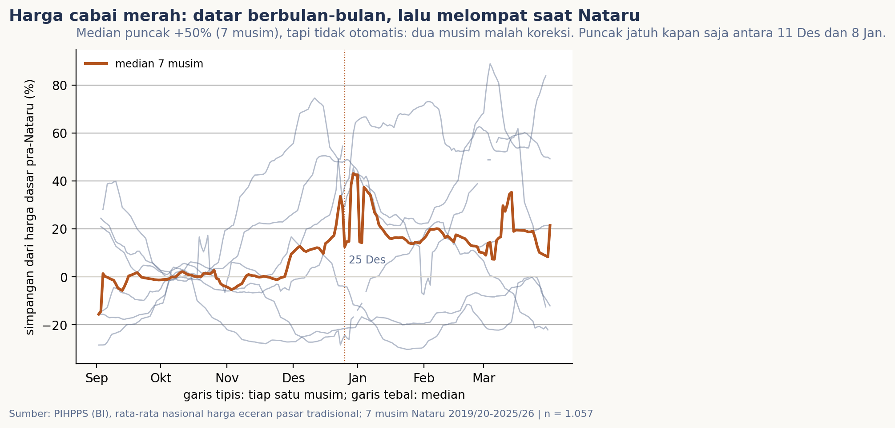
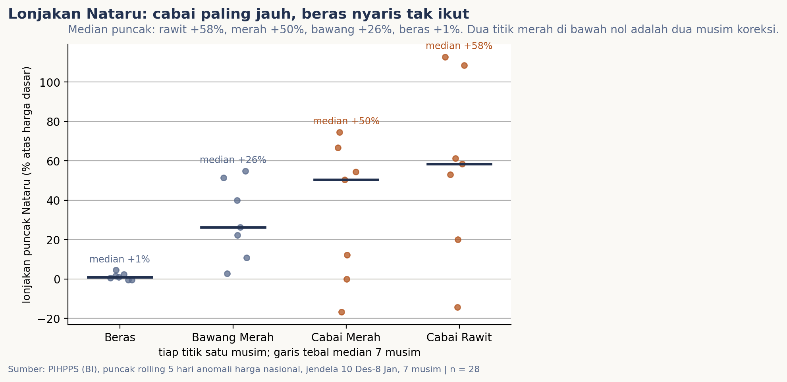

# Cabai menjelang Nataru: benar selalu melonjak?

Setiap Desember kabar yang sama kembali: harga cabai naik karena permintaan Natal
dan tahun baru (Nataru). Kabar itu diulang begitu sering sampai terdengar seperti
hukum pasti. Saya penasaran: kalau tujuh musim Nataru disusun berdampingan,
seberapa sering lonjakan itu benar terjadi, untuk cabai jenis apa, dan apakah
barang lain ikut-ikutan?

## Data & cara ukur

Saya pakai harga eceran harian dari PIHPPS (Pusat Informasi Harga Pangan Strategis
Nasional, bi.go.id/hargapangan), hasil survei enumerator di pasar tradisional yang
dikoordinasikan Bank Indonesia. Empat komoditas: cabai merah dan cabai rawit
(pasangan yang selalu disebut dalam kabar Nataru), ditambah bawang merah dan beras
sebagai pembanding. Rentangnya tujuh musim, September sampai Maret 2019/20 hingga
2025/26, dan hanya hari kerja yang tercatat; per musim tersedia sekitar 151 titik
per komoditas, atau 4.228 titik nasional keseluruhan, ditambah 141 ribu baris
harga per provinsi.

Angka nasionalnya adalah rata-rata antar-provinsi yang dihitung server, bukan
rata-rata tertimbang jumlah penduduk; konsekuensinya saya kupas di bagian batas.
Harga dasar tiap musim saya tetapkan sebagai median 1 September sampai 20 November,
masa tenang sebelum riak Nataru, lalu diukur simpangan harga terhadap dasar itu
dengan rerata bergerak lima hari.

## Pembedahan



Disusun seperti ini, riaknya langsung kelihatan: harga cabai merah datar
berbulan-bulan di sekitar dasarnya, lalu melompat begitu Desember tiba. Puncak
mediannya +50 persen dari harga dasar. Tapi puncaknya tidak disiplin jadwal:
jatuh kapan saja antara 11 Desember dan 8 Januari. Perhatikan juga dua hal yang
jarang masuk kabar. Pertama, lonjakan itu sering tidak pulih: memasuki Januari,
garis median bertahan di atas dasar sampai Maret. Kedua, garis tipis tiap musim
menyebar jauh; ada yang mencekung di bawah nol tepat saat Nataru.



Dikumpulkan per komoditas, polanya makin tegas. Cabai rawit melonjak di 6 dari 7
musim dengan median puncak +58 persen (selang kepercayaan bootstrap +20 sampai
+108); cabai merah di 5 dari 7 musim dengan median +50 persen (selangnya masih
lebar, 0 sampai +67); bawang merah +26 persen dan selalu positif; beras praktis
diam, median +1 persen. Kalau ditanya komoditas apa yang paling "Nataru",
jawabannya cabai, bukan bahan pangan pada umumnya.

Desember juga bulan paling berisik untuk barang-barang ini: simpangan baku gerak
harian bawang merah 2,7 kali lipat masa tenangnya, cabai merah 1,8 kali, cabai
rawit 1,4 kali, beras 1,2 kali. Dan lonjakan itu tidak rata: pada hari puncak
cabai merah tiap musim, provinsi termahal biasanya membayar 3,8 kali lipat harga
provinsi termurah.

Musim yang baru lewat memberi contoh penyeimbang: 2025/26 puncak cabai merah
hanya +12 persen, sementara cabai rawit tetap +58 persen.

## Temuan

> Iya, lonjakan Nataru itu nyata dan khas cabai: cabai rawit melonjak di 6 dari 7 musim (median puncak +58%), cabai merah di 5 dari 7 (median +50%), sementara beras praktis diam (+1%) dan bawang merah ada di antaranya (+26%). Tapi "selalu" terdengar terlalu pasti: harga cabai merah dua kali malah turun saat Nataru, dan harga yang sudah terlanjur naik jarang turun kembali sebelum Maret.

## Batasnya, jujur

Lima hal perlu dibilang. Pertama, harga nasional adalah rata-rata antar-provinsi
dari server, bukan rata-rata tertimbang populasi, jadi angkanya menceritakan
"provinsi mewakili", bukan "warga mewakili". Kedua, data hanya hari kerja, sehingga
kurva dihaluskan lima hari dan puncak tidak bisa dibaca per tanggal pasti. Ketiga,
hanya tujuh musim: untuk cabai merah selang kepercayaan median lonjakan masih
menyentuh nol, maka klaim kuatnya sengaja berbunyi "5 dari 7 musim", bukan
"selalu". Keempat, sisa musim setelah Januari tumpang tindih dengan Ramadan di
beberapa musim (paling jelas 2024/25 ketika Ramadan jatuh Maret), jadi angka
plateau-nya bukan warisan murni Nataru. Kelima, pilihan tanggal jadi kurang
sensitif berkat harga dasar yang dihitung per musim, bukan dari masa lain.

## Cara reproduksi

```bash
python3 tools/data_scraping.py     # panen snapshot harian PIHPPS (butuh internet, sekitar 2 jam)
python3 -m nbconvert --to notebook --execute --inplace analisis.ipynb
```

Semua berkas pendukung terbuka: `data/README.md` ( kontrak sumber, cara ambil, dan
hal-hal yang digarisbawahi), `data/harga-nasional.csv` dan `data/harga-provinsi.csv`
(rangkaian panen), `data/metrik-005.json` (semua angka temuan, bootstrap 10.000
ulang dengan seed 2026), serta cache respons mentah di `data/mentah/pihps/`.
Panen dilakukan 22-23 September 2026.
