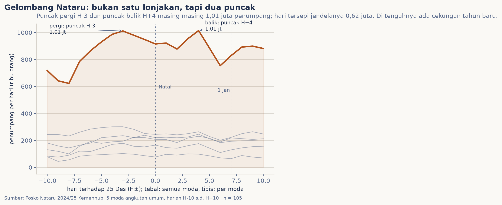
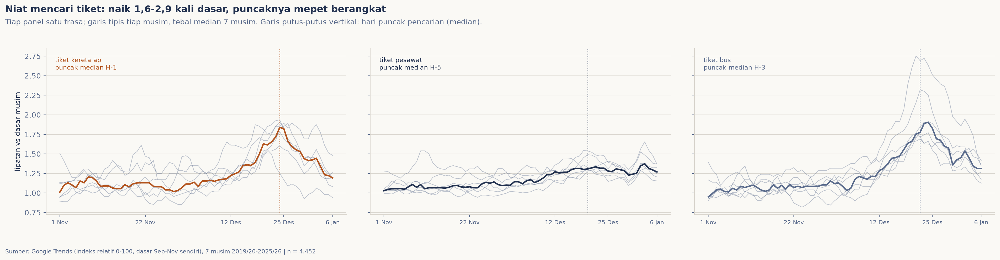

# Puncak perjalanan Nataru: arus berangkat atau arus balik?

Setiap akhir tahun beritanya sama: "puncak arus mudik diperkirakan hari ini". Seolah gelombang Nataru itu satu lonjakan besar menuju 25 Desember. Saya penasaran dan membuka datanya langsung: seperti apa bentuk gelombang itu sesungguhnya, dan sejak kapan sebenarnya orang berniat pergi?

## Data & cara ukur

Dua sumber terbuka, dua peran yang sengaja dibedakan. Untuk perjalanan nyata, saya pakai data harian Posko Nataru 2024/25 Kementerian Perhubungan (katalog HUBNET): lima moda angkutan umum (jalan, kereta api, udara, laut, dan sungai-danau-penyeberangan) selama 21 hari, H-10 sampai H+10, 15 Desember 2024 hingga 4 Januari 2025. Total tercatat 18,3 juta penumpang-hari di seluruh moda itu. Satu musim memang, jadi untuk niat mencari tiket saya baca sumber kedua: indeks Google Trends untuk "tiket kereta api", "tiket pesawat", dan "tiket bus" selama tujuh musim Nataru.

Ada dua catatan jujur sejak awal. Angka Posko adalah penumpang-hari yang terpantau, dan penerbitnya menandai data di luar H-7 sampai H+10 belum direkonsiliasi. Sedangkan indeks Trends adalah proporsi pencarian per musim, bukan orang, maka antar musim hanya boleh dibaca pada bentuknya. Karena itu kedua sumber ini saya biarkan bercerita berdampingan, tanpa digabung jadi satu angka.

## Pembedahan



Dibuka sehari demi sehari, gelombangnya bukan satu lonjakan. Ia teras tinggi selama tiga pekan dengan dua puncak yang jelas: arus pergi memuncak di H-3 (1,01 juta penumpang) lalu menyusut pelan melewati Natal, naik lagi ke arus balik di H+4 (1,01 juta penumpang), dengan cekungan pergantian tahun di tengahnya (hari tersepi jendela itu hanya 0,62 juta). Hampir semua moda ikut berdenyut serempak; udara dan kereta api paling besar harinya. Di jendela penuh ini arus balik (H+1 s.d. H+10, 8,91 juta) bahkan sedikit lebih ramai dari arus pergi (H-10 s.d. H-1, 8,49 juta).



Dan sejak kapan niat itu terasa? Di tujuh musim, pencarian tiga frasa tiket konsisten naik menjelang Nataru: "tiket kereta api" mediannya 1,8 kali dasar musimnya, "tiket pesawat" 1,4 kali, "tiket bus" 1,9 kali. Tetap yang paling menarik adalah timingnya: puncak pencarian tidak berminggu-minggu sebelumnya, tetapi mepet hari keberangkatan. "tiket kereta api" mediannya di H-1, "tiket bus" di H-3, "tiket pesawat" di H-5. Pola yang sama berulang di setiap musim, termasuk musim pandemi.

## Temuan

> Gelombang Nataru bukan satu lonjakan: ia teras tiga pekan bertulang dua puncak, arus pergi di H-3 lalu arus balik di H+4 (masing-masing 1,01 juta penumpang/hari, Posko Nataru 2024/25), dengan cekungan pergantian tahun di tengahnya. Dan orang tidak menyiapkan Nataru berpekan-pekan: pencarian tiket konsisten memuncak hanya beberapa hari sebelum berangkat (median H-1 sampai H-5, tujuh musim berturut-turut).

Pesannya praktis juga: kalau berita bilang "puncak arus mudik hari ini", kenyataannya puncak itu ada dua, dan yang kedua (balik) sedikit lebih besar. Untuk barang bawaan dan rencana pulang, H+4-lah hari paling sesak, bukan H-3.

## Batasnya, jujur

Lima hal perlu dibilang. Pertama, perjalanan nyata baru tersedia terbuka untuk satu event Nataru (2024/25); bentuk dua puncak dibaca dari 21 hari itu, bukan rerata banyak tahun. Kedua, angka Posko adalah penumpang-hari terpantau, dan angka rekap yang tercetak di berita memakai penyaringan tersendiri (misalnya 17,2 juta "angkutan umum") sehingga berbeda sedikit dari jumlah tabel terbuka. Ketiga, indeks Google Trends relatif per musim dan bukan jumlah orang. Keempat, mencari tiket bukan berarti pergi, karena orang bisa cari jadwal tanpa pulang, jadi niat tidak saya baur dengan perjalanan nyata. Kelima, jendela Posko mencakup akhir pekan dan hari libur nasional; denyutnya bukan pola hari kerja murni.

## Cara reproduksi

```bash
python3 tools/data_scraping.py     # Posko Kemenhub + Google Trends (butuh internet, pytrends)
python3 -m nbconvert --to notebook --execute --inplace analisis.ipynb
```

Semua berkas pendukung terbuka: `data/README.md` (kontrak kedua sumber dan hal-hal yang digarisbawahi, termasuk tiga penolakan rate-limit dan resolusi bulanan yang ditolak), `data/pergerakan-nataru-2024-25.csv`, `data/metrik-006.json` (semua angka temuan, bootstrap 10.000 ulang seed 2026), serta cache mentah di `data/mentah/trends/`. Panen dilakukan 24 September 2026.
