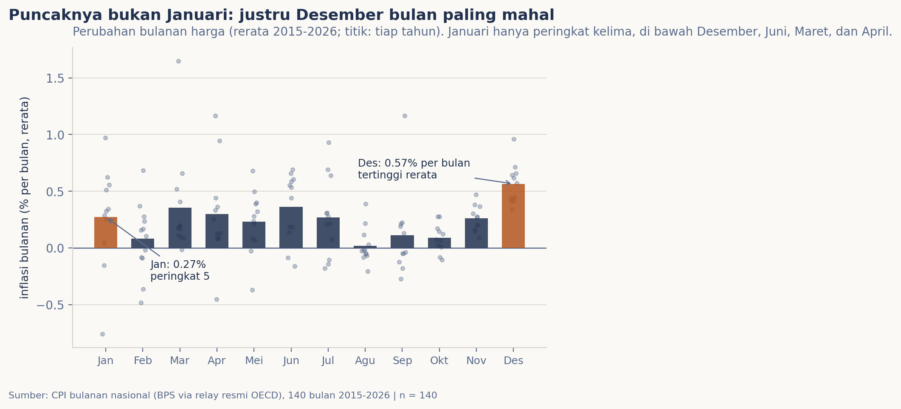
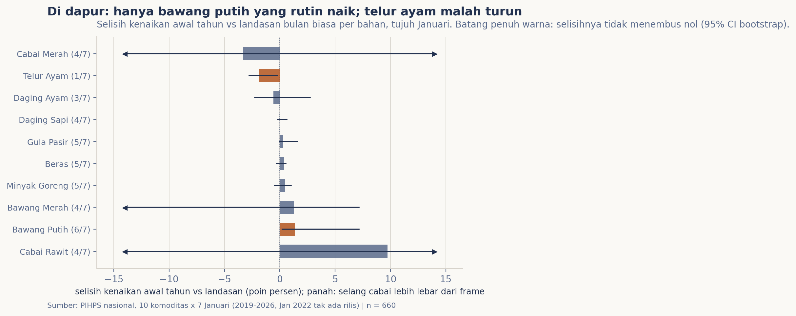

# Inflasi awal tahun: siapa yang naik?

Setiap Januari keluhan yang sama mengalun: "awal tahun serba mahal". Saya penasaran seberapa benar keluhan itu di dalam data: apakah Januari memang bulan paling mahal sepanjang tahun, dan kalau ada yang naik, dan kalau ada yang naik, bahan apa saja persisnya yang menaikkannya?

## Data & cara ukur

Dua lapis sumber, dua peran yang sengaja dipisah. **Lapis resmi**: indeks harga konsumen (IHK) bulanan yang dihitung BPS dan direlay lewat API statistik resmi OECD tanpa kunci; 140 bulan, Januari 2015 sampai Agustus 2026. Yang dibaca bukan besar harga, melainkan perubahan bulan ke bulan (inflasi bulanan), dan polanya dirata-rata menurut kalender bulan. **Lapis dapur**: PIHPS (bi.go.id/hargapangan) memantau harga eceran sepuluh komoditas pangan di pasar tradisional seluruh provinsi tiap hari kerja; saya ambil satu snapshot pertengahan bulan, Oktober 2018 sampai Agustus 2026, dan "awal tahun" dibaca sebagai perubahan Desember pertengahan ke Januari pertengahan. Tujuh Januari terbaca (Januari 2022 termasuk sembilan bulan yang membalas kosong dari server). Dua lapis ini dibaca berdampingan, tidak digabung satu angka.

## Pembedahan

Kalau desas-desus "awal tahun serba mahal" itu benar, Januari harusnya duduk di puncak daftar inflasi bulanan. Kenyataannya tidak: bulan dengan perubahan harga bulanan terbesar dalam sebelas tahun terakhir justru Desember, rerata
0,57% per bulan. Januari hanya peringkat kelima dengan 0,27%, di bawah Juni, Maret, dan April. Dari sebelas tahun penuh, Januari menjadi bulan dengan inflasi tertinggi hanya dua kali (2017 dan 2018); Januari 2025 malah deflasi 0,76%, terendah dalam seluruh rangkaian. Di atas kertas, "peak" biaya hidup tahunan terjadi tepat sebelum awal tahun, di musim yang sama dengan dua puncak perjalanan Nataru di edisi sebelumnya.

Tapi keranjang belanja bukan indeks tertimbang; yang membuat dompet terasa berat adalah bahan yang konkret naik. Di kelompok pembelanjaan dapur, perbandingannya dinyatakan sebagai selisih: kenaikan Januari dikurangi kenaikan biasa bahan yang sama di bulan lain, dirata-rata tujuh Januari. Hasilnya mengecilkan hujan pada isyarat "semua naik": hanya bawang putih yang konsisten naik melebihi biasa (median +1,39 poin persen, naik 6 dari 7 Januari, selang keyakinannya tidak menembus nol). Di ujung sebaliknya justru ada bahan yang rutin turun di awal tahun: telur ayam, -1,90 poin persen, dan di tujuh Januari hanya sekali naik. Sisanya bergantung tahun: cabai rawit bisa meledak +11% di Januari bernasib sial atau datar sama sekali; daging sapi, daging ayam, dan gula praktis diam.

## Temuan

> Mitos "awal tahun serba mahal" tidak tercermin di indeks resmi: puncak inflasi bulanan rerata ada di Desember (0,57% per bulan), sementara Januari hanya peringkat kelima (0,27%). Di keranjang dapur pun tidak semua naik: dari sepuluh bahan, hanya bawang putih yang konsisten naik melebihi biasa di awal tahun (+1,39 poin persen, 6 dari 7 Januari), dan telur ayam justru rutin turun (-1,90 poin persen, hanya 1 dari 7). Rasa "mahal" di awal tahun rupanya bertahan terutama lewat bumbu-bumbu, dan itupun hanya yang putih.

Pesannya praktis: kalau anggaran dapur awal tahunmu terasa berat, cabutkan dugaannya ke harga bawang dan cabai,  angan pada "semua harga". Sisanya, di data kami, relatif tenang.

## Batasnya, jujur

Enam hal perlu dibilang. Pertama, lapis resmi direlay lewat OECD; angkanya angka BPS, tetapi katalog BPS tidak dapat diakses dari lingkungan panen ini (tabel membalas 403, API minta token), sehingga kontrak aslinya tidak bisa
didokumentasi ulang di sini. Kedua, IHK berganti tahun dasar sepanjang 2015-2026; yang dibaca adalah perubahan bulanannya, yang masih sah dirantai. Ketiga, PIHPS hanya memantau sepuluh komoditas di pasar tradisional: "daftar naik" di edisi ini adalah daftar keranjang dapur, bukan komponen resmi IHK yang pintu datanya tertutup. Keempat, nasional PIHPS adalah rerata provinsi dihitung server, bukan rerata tertimbang populasi. Kelima, sembilan bulan tidak ada rilis PIHPS di lingkup panen ini (Januari 2022 di antaranya), sehingga ramp dibaca dari tujuh Januari. Keenam, pertengahan bulan ke pertengahan bulan adalah proksi transisi bulan; gerakan "akhir tahun" per hari tidak diikuti di edisi ini.