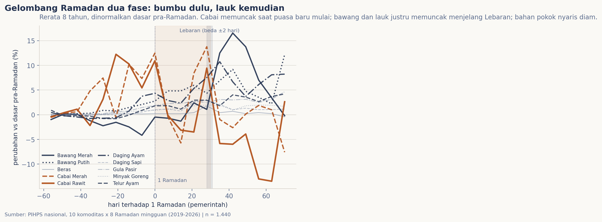
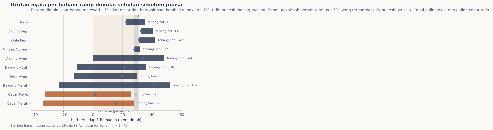

# Harga pangan saat Ramadan: kapan puncak tiap bahan?

Setiap Ramadan orang bilang: "harga pasti naik". Benar, tapi kalimat itu ternyata menyembunyikan sesuatu yang lebih menarik: tiap bahan rupanya naik di waktu yang berbeda. Saya bongkar delapan Ramadan dari 2019 sampai 2026 untuk menjawabnya: kapan tiap bahan mulai menyala, di mana puncaknya, dan kapan kembali tenang?

## Data & cara ukur

Satu sumber terbuka: PIHPS (bi.go.id/hargapangan), pasar tradisional di 34 provinsi, sepuluh komoditas pangan strategis, dicatat tiap hari kerja. Saya ambil satu snapshot Rabu per jendela Ramadan selama delapan tahun: mulai 56 hari sebelum 1 Ramadan sampai 42 hari setelah 1 Syawal, dengan tanggal ketetapan pemerintah RI yang terangkum di `data/tanggal-ramadan.csv`. Supaya sejenak, tiap tahun dinormalkan terhadap dasar jendelanya sendiri: rata-rata pekan-pekan yang lebih dari lima pekan sebelum 1 Ramadan. Kontrak sumber sama dengan Edisi 005/007, dengan catatan jujur bahwa server bergeser ke rilis terakhir saat tanggalnya tanpa rilis baru, dan ada sembilan bulan kosong di upstream (beberapa segmen 2019/2021/2022 jatuh tepat di fase pasca-Lebaran) yang didokumentasi penuh di `data/README.md`.

## Pembedahan

Rata-rata lintas delapan tahun membuka pola tegas: gelombangnya dua fase. Cabai merah dan cabai rawit (oranye) mulai menyala jauh sebelum puasa, memuncak saat puasa baru berjalan beberapa pekan, lalu mengendur menjelang Lebaran. Bawang merah, telur, dan daging ayam justru bergerak sebaliknya: mulai tanpa suara di awal puasa lalu melejit mendekati Lebaran, dan baru mereda satu-dua pekan sesudahnya. Empat bahan pokok (beras, daging sapi, gula, minyak goreng) nyaris diam sepanjang musim: puncaknya hanya 2-4% dan kurvanya datar.

Peta fase menata urutannya. Batang dimulai saat bahan melewati +5% dari dasar dan berakhir saat kembali di bawah +2%, ditulis dalam hari relatif terhadap 1 Ramadan. Dibaca per baris: cabai rawit menyala paling awal (median hari −32; ramp mulai sebulan sebelum puasa) dan tenang paling dini (hari +26); cabai merah naik hari −34, tenang +28. Titik puncak masing-masing: cabai rawit di median hari +2 (tepat saat puasa dimulai, maksimal 22,9% relatif dasar), cabai merah di +15. Sementara fase Lebaran dipegang kelompok lauk: bawang merah memuncak di hari +42 (sekitar sepuluh hari sesudah Lebaran, +18,6%) dan baru tenang +52; daging ayam di +34 (+13,7%) tenang +48; telur di +20 (+8,3%). Bahan pokok tak pernah menembus garis +5% sama sekali; yang tergambar di sana hanyalah titik puncaknya yang rendah itu.

## Temuan

> Gelombang Ramadan itu dua fase, bukan satu: cabai meledak tepat saat puasa dimulai (puncak median hari +2 untuk rawit, +15 untuk merah) dan sudah mereda menjelang Lebaran; bawang merah, telur, dan ayam baru memuncak menjelang Lebaran (+20 sampai +42) dan tenang satu-dua pekan sesudahnya. Bahan pokok nyaris tidak ikut (puncak 2-4%). Dan ramp ini dimulai lebih awal dari perkiraan: harga cabai sudah melewati +5% sekitar sebulan sebelum puasa.

Pesannya praktis: jangan tunda belanja cabai untuk bekal awal puasa; pantau harganya sejak sebulan sebelum. Tapi bahan untuk opor dan ketupat Lebaran justru bahan yang harganya ikut naik paling akhir; paketnya bisa disiapkan pelan-pelan.

## Batasnya, jujur

Enam hal perlu dibilang. Pertama, PIHPS memantau sepuluh komoditas di pasar tradisional, bukan harga di semua kanal dan bukan semua bahan. Kedua, "nasional" adalah rerata provinsi dihitung server, bukan rerata tertimbang populasi. Ketiga, tanggal puasa dan Lebaran dipakai dari ketetapan pemerintah; penetapan Muhammadiyah berbeda satu-dua hari di sebagian tahun, itu bisa menggeser posisi puncak sehingga pembacaan di sini lebih stabil jika dibaca per pekan. Keempat, snapshot Rabu adalah proksi mingguan; segmen tanpa rilis baru tampil datar, ada beberapa yang berada di fase pasca-Lebaran (server kosong dari upstream, bukan harga benar-benar diam). Kelima, delapan tahun per bahan dan naik-turunnya amat bergantung tahun, jadi sebagian selang keyakinan lebar. Keenam, "puncak" di sini dibaca relatif terhadap dasar jendelanya sendiri: nilai absolut tertinggi sepanjang tahun bahan yang sama bisa berada di musim lain (Nataru di Edisi 005 menunjukkan cirinya).