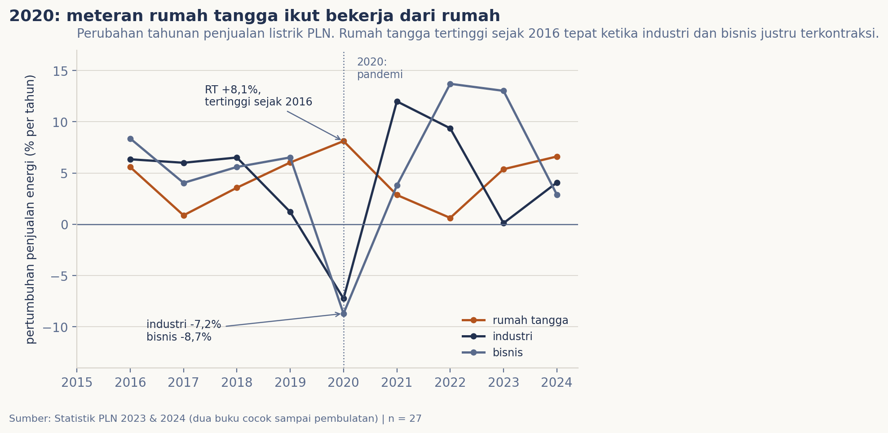
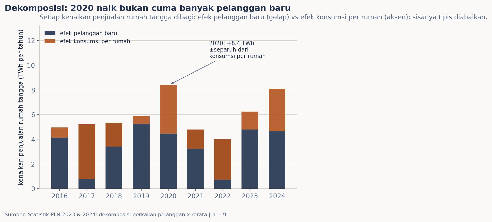

# Listrik saat orang lebih banyak di rumah

Tahun 2020, puluhan juta orang dipaksa bekerja dan sekolah dari rumah dalam waktu beberapa pekan. Kalau pergeseran itu benar sebesar rasanya, jejaknya harus terekam di satu tempat yang tidak pakai survei dan tidak pakai ingatan: meteran listrik. Saya buka sepuluh tahun Statistik PLN (2015-2024) untuk melihat apa yang terjadi saat orang lebih lama di rumah, dan berapa lama jejaknya bertahan sesudahnya.

## Data & cara ukur

Sumbernya dua buku Statistik PLN resmi (edisi 2023 dan 2024), masing-masing memuat deret tahunan penjualan listrik per kelompok pelanggan: rumah tangga, industri, bisnis, sosial, gedung kantor pemerintah, dan penerangan jalan. Karena data beban per jam tidak dibuka untuk publik, kisah ini dibaca pada skala tahun. Metriknya dua. Pertama, perubahan tahunan penjualan tiap kelompok, dihitung sebagai pertumbuhan terhadap tahun sebelumnya. Kedua, dekomposisi: setiap kenaikan penjualan rumah tangga saya bagi dua menjadi efek pelanggan baru (jumlah pelanggan tumbuh tiga sampai empat juta per tahun) dan efek konsumsi per rumah (energi rata-rata yang dipakai satu pelanggan). Energi dihitung PLN dalam GWh; satu GWh kira-kira listrik 650 rumah tangga selama setahun.

Kedua buku saya parsing otomatis dari PDF dan saling dicek satu sel sama satu sel. Hasilnya cocok sampai pembulatan, kecuali satu kejutan: pelanggan penerangan jalan tahun 2015 salah cetak di edisi 2023 (156.782) dan diperbaiki di edisi 2024 (186.118; kolom total kedua buku masing-masing konsisten dengan angkanya sendiri). Untuk sel itu saya pakai angka dari edisi terbaru. Buku-buku mentahnya tersimpan di `data/mentah/pln/` beserta kontrak ekstrak di `data/README.md`.

## Pembedahan

Grafik pertama membandingkan pertumbuhan penjualan tiga kelompok. Sebelum 2020 semuanya bergerak di koridor yang sama: naik satu sampai delapan persen per tahun. Lalu tahun 2020 tiba dan ketiganya berpisah tajam. Rumah tangga (oranye) melonjak ke +8,1%, pertumbuhan tertingginya sejak 2016, tepat ketika industri jatuh -7,2% dan bisnis -8,7%. Bisnis baru benar-benar pulih pada 2022 (+13,7%), industri lebih dulu memantul di 2021 (+12,0%). Pola berseberangan semacam ini tidak muncul di tahun lain dalam seri: efek "orang pulang" terekam jelas meski kita cuma melihat keseluruhan tahun.

Grafik kedua menjawab pertanyaan lanjutan: lonjakan rumah tangga itu dari mana? Setiap tahun, kenaikan penjualan dibagi dua: balok gelap untuk efek pelanggan baru, balok oranye untuk efek konsumsi per rumah. Tahun-tahun biasa didominasi pelanggan baru, dan efek konsumsi per rumah malah sering negatif (orang yang sambung baru cenderung berpakai lebih irit). Tahun 2020 bedanya terang: total naik +8,4 TWh, dan sekitar separuhnya (+4,0 TWh) datang dari konsumsi per rumah, sumbangan positif terbesar dari komponen ini dalam satu dekade. Rata-rata per rumah naik dari 1.490 menjadi 1.545 kWh setahun (+3,7%). Angka ini turun lagi 2021-2022 saat orang kembali beraktivitas di luar, lalu perlahan pulih; pada 2024 rata-rata per rumah sudah kembali menyamai level pandemi (1.541 vs 1.545 kWh, kurang empat kWh), kali ini dengan 84,7 juta pelanggan yang terus bertambah.

## Temuan

Meteran PLN mengonfirmasi pandemi sebagai eksperimen alami terbesar tentang bekerja dari rumah: penjualan listrik rumah tangga 2020 naik +8,1%, tertinggi sejak 2016, persis ketika industri dan bisnis terkontraksi. Kenaikannya bukan sekadar pelanggan baru: konsumsi per rumah benar berubah naik +3,7%. Jejaknya tidak langsung hilang; setelah surut pada 2021-2022, konsumsi per rumah pada 2024 sudah kembali ke level pandemi, sementara jumlah pelanggan terus tumbuh hampir lima puluh persen dalam sedekade.

## Batas & cara reproduksi

Enam hal perlu dibilang jujur. Pertama, ini penjualan PLN per kelompok tarif setahun penuh: jam berapa listrik dipakai tidak terlihat. Kedua, "rumah tangga" adalah kelompok tarif, dan warung kecil yang tarifnya rumah tangga ikut di dalamnya. Ketiga, 2020 adalah kejadian alam, bukan eksperimen rancangan: puluhan hal lain ikut bergerak bersamaan (rantai pasok, pemulangan kampung), sehingga angka ini baca sebagai jejak, bukan kausalitas ketat. Keempat, dekomposisi pelanggan kali konsumsi adalah aproksimasi orde pertama; sisa yang tipis dicetak di notebook, dan tahun 2020 sisanya setengah TWh di depan sepuluh. Kelima, angka 2024 di buku 2024 adalah sementara dan bisa direvisi edisi berikutnya. Keenam, ini PLN saja; pelanggan non-PLN (petambat langsung, koperasi) tidak ikut dihitung.