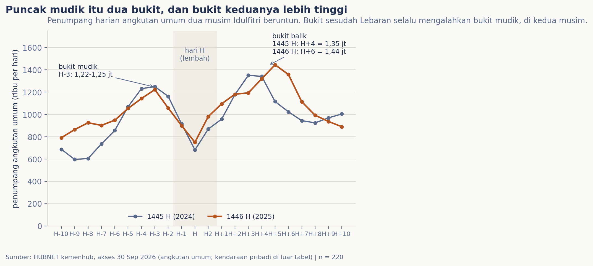
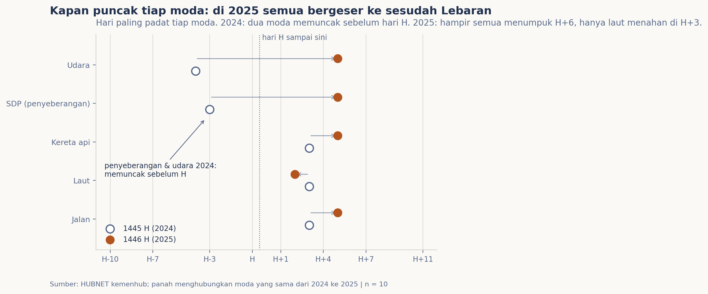

# Mudik 1448 H: bentuk puncaknya

Setiap musim mudik orang bertanya "kapan puncaknya?", dan jawaban yang beredar satu kata: H-sekian. Andaikata angka harian dua musim Idulfitri terakhir memperlihatkan bentuk yang lebih jujur: musim ini tidak berpuncak satu kali. Ia naik ke satu bukit, jatuh ke lembah saat hari Lebaran, lalu meledak di bukit kedua yang selalu lebih tinggi. Edisi ini terbit saat musim 1448 H sedang berjalan; dua musim sebelumnya, 1445 H dan 1446 H, memberi peta betonnya.

## Data & cara ukur

Sumbernya satu katalog terbuka Kemenhub (HUBNET): jumlah penumpang harian lima moda angkutan umum (jalan, kereta api, udara, laut, serta sungai, danau, dan penyeberangan) di matriks pantauan posko, dari H-10 sampai H+10 atau H+11, untuk Idulfitri 1445 H (2024, 21,5 juta penumpang-hari tercatat) dan 1446 H (2025, 23,1 juta). Katalog ini memang hanya menangkap angkutan umum; irama mudik tetap ia yang membacakan paling disiplin, karena tabel sama lintas musim. Metriknya empat: bentuk harian dan bukitnya, hari paling padat tiap moda, bagian pergerakan di sisi pasca-Lebaran, dan hari median musim, yakni hari ketika separuh total pergerakan sedunia musim itu baru terlewati. Kalender katalog menandai dua hari Lebaran (H 1, H 2), masing saya petakan lurus ke skala satu garis: H-10 ke -10, H 2 ke 1, H+1 ke 2, dan seterusnya.

## Pembedahan

Gambar pertama menyusun kedua musim dalam satu bidang, dan polanya hampir tak percaya betapa patuhnya. Bukit mudik menumpuk di H-3 (1,25 juta penumpang pada 1445 H, 1,22 juta pada 1446 H). Lalu lembah saat hari H: volume anjlok ke kira-kira 70% hari biasanya, sebab para pe-mudik sudah sampai. Kemudian datang bukit kedua, arus balik, yang menguat dari H2 dan meledak H+4 sampai H+6: 1,35 juta penumpang pada 1445 H, 1,44 juta pada 1446 H. Puncak tertinggi kedua musim adalah bukit balik, bukan bukit mudik. Sebabnya masuk akal: pergi itu bisa diangsur (orang menyerbu mudik pelan-pelan sejak seminggu sebelumnya), pulang tidak bisa, karena semuanya punya batas hari masuk kerja yang sama.

Gambar kedua menandai hari paling padat tiap moda. Pada 1445 H denyarannya terbelah: kereta api, bus (jalan), dan laut memuncak di sisi balik (H+4), tapi penyeberangan dan pesawat justru memuncak sebelum hari H (H-3 dan H-4), jejak rombongan Merak dan pemesan tiket mudik awal. Pada 1446 H, musim yang kalender cuti bersamanya diperpanjang, denyarannya berubah total: empat dari lima moda memuncak di H+6, dan hanya laut menahan di H+3. Dua bukti angka tambahan: 54-55% seluruh penumpang-hari jatuh di sisi sesudah hari Lebaran, dan hari median kedua musim sama-sama +2: separuh musim baru berlalu setelah dua hari penuh pasca-Lebaran.

## Temuan

Bentuk puncak mudik Lebaran adalah dua bukit dengan satu lembah: bukit mudik di H-3, lembah hari H, lalu bukit balik H+4-H+6 yang selalu lebih tinggi. Orang pergi mengangsur tapi pulang serempak, sehingga puncak sejati musim ini terletak di penamatnya. Letak bukit balik bergeser mengikuti kalender cuti bersama: H+4 pada 1445 H, H+6 pada 1446 H. Dan bentuk-bentuk musim 1448 H, dengan premis yang sama masih berlaku, layak dibaca dari peta kedua musim ini. Rilis posko 1447 H menambah satu noktah: realisasi pergerakan selalu melampaui survei niat (143,9 juta direncanakan menjadi 147,55 juta pergerakan menurut Mobile Positioning Data; pola yang sama terjadi 2025, 146,5 menjadi 154,6).