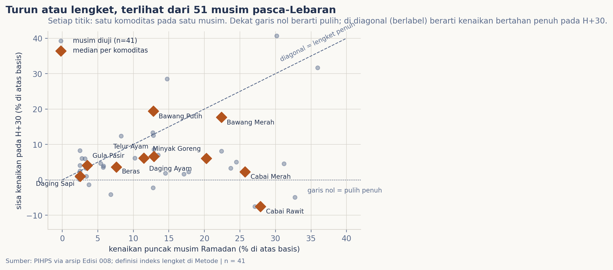
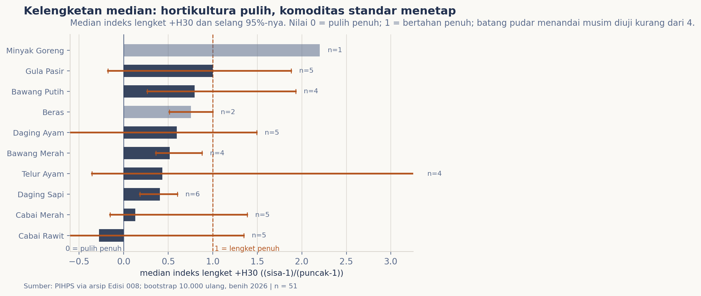

# Harga setelah Lebaran: turun atau lengket?

## Latar Belakang

Dua tesis populer bertentangan mengenai perilaku harga pangan sesudah musim Ramadan. Tesis pertama menyebut harga kembali turun begitu momentum musiman usai; tesis kedua, kerap dirumuskan sebagai asimetri roket-dan-bulu, menyatakan harga yang terlanjur naik enggan untuk turun. Edisi ini merumuskan kedua prediksi tersebut dalam satu ukuran: bagian kenaikan harga musim Ramadan yang masih menetap 30 dan 42 hari setelah Lebaran, dirata-ratakan secara aman lewat median lintas delapan musim teramati (1440-1447 H).

## Data & Metode

Sumber tunggal ialah PIHPS (Pusat Informasi Harga Pangan Strategis [1]): rerata nasional mingguan, snapshot hari Rabu, pasar tradisional untuk sepuluh komoditas pangan; delapan musim Ramadan 1440-1447 H, dengan kontrak panen identik Edisi 008 [2]. Kalender memakai ketetapan resmi pemerintah [3]. Definisi metrik (diterjemahkan istilahnya secara eksplisit):

- **basis**: rerata harga minggu-minggu 70 s.d. 35 hari sebelum 1 Ramadan.
- **kenaikan puncak**: maksimum harga relatif basis pada jendela H-35 hingga H+8 relatif Lebaran. Musim dengan kenaikan di bawah 2% tidak diuji, karena tidak ada kenaikan untuk diamati kelengketannya.
- **sisa**: harga relatif basis pada snapshot terdekat +30 atau +42 hari pasca-Lebaran, toleransi empat hari.
- **indeks lengket**: (sisa - 1)/(puncak - 1). Nilai 0 berarti pulih penuh ke basis; 1 berarti menetap penuh; di atas 1 berarti harga justru naik setelah Lebaran; negatif berarti turun melewati basis.

Ringkasan komoditas dihitung sebagai median antar-musim; selang kepercayaan 95% diperoleh dari bootstrap 10.000 pengambilan ulang atas musim, benih acak 2026, sehingga hasil sama persis saat direproduksi. Satu musim gugur serentak (1442 H) karena celah rilis sumber; itu didokumentasikan dan dihitung jujur di kontrak data agregat.

## Hasil

Berdasarkan 70 pasangan komoditas-musim, 51 lolos pengujian dan 41 terpetakan penuh dengan titik sisa +30 (Gambar 1). Pola umum tidak mendukung generalisasi "semuanya lengket". Peta ini justru membelah: hampir semua kenaikan hortikultura (cabai, bawang, sebagian besar protein) berinvers nyaris ke basis, sementara kenaikan pada komoditas berharga administratif-standar, yakni gula, menetap penuh.

Gambar 1 memetakan setiap musim yang diuji ke bidang kenaikan-vs-sisa: titik-titik di dekat garis diagonal adalah musim musiman lengket penuh; titik di seputar garis nol adalah musim yang pulih. Median per komoditas yang dianotasi menegaskan urutan.

Gambar 2 merangkum median indeks lengket +30 hari beserta selang 95% (n menandai jumlah musim diuji; batang pudar menandai sampel lebih kecil dari empat musim). Urutannya tegas terurut: cabai rawit paling pulih (median -0,28, artinya pasca-Lebaran jeblok di bawah basisnya), diikuti cabai merah (0,13), daging sapi (0,41), telur ayam (0,44), bawang merah (0,52), daging ayam (0,60) dan bawang putih (0,80); lalu golongan yang tidak pernah turun: beras (0,76; hanya dua musim naik), gula pasir (1,00) dan minyak goreng (2,20; satu musim terujinya adalah krisis 2022, rezim ekstrem yang tak bisa dibaca musiman).

## Pembahasan

Kedua tesis populer tidak terbukti secara umum; masing-masing benar dalam rezim pembentukan harganya sendiri. Untuk hortikultura bergejolak, prediksi "turun" benar kuat dan cepat: 30 hari cukup untuk mengembalikan 87-128% dari kenaikan cabai. Untuk komoditas ter-administrasi/standar, prediksi "lengket" benar: ketika gula naik lima dari delapan musim, kenaikannya bertahan penuh (median 1,00) dan pada titik +42 hari malah menguat (1,25). Konsistensi pola +30 vs +42 di semua komponen menguatkan bacaan bahwa temuan ini tidak lahir dari pemilihan momen potret yang kebetulan.

## Batasan

Ukuran memakai agregat mingguan nasional pasar tradisional; harga eceran ritel atau wilayah spesifik dapat mengikuti lintasan berbeda. Kelengketan adalah sifat kenaikan, sehingga musim tanpa kenaikan terdefinisi keluar dari uji; ini membuat simpulan bagi komoditas berharga relatif stabil sensitif pada ambang 2%. Delapan musim adalah sampel kecil untuk membaca interaksi kalender; selang itu ditampilkan lebar apa adanya. Guncangan makro 2019/2022 melampaui variabilitas biasa dan diringkas median. Akhirnya, angka Lebaran memakai ketetapan pemerintah, dan harga pembanding +30/+42 hari adalah snapshot Rabu terdekat.

## Kesimpulan

Terhadap pertanyaan "harga setelah Lebaran: turun atau lengket?" bukti delapan musim menjawab kondisional: **turun** bagi komoditas bergejolak (terutama cabai, sampai jeblok di bawah basis), **lengket** bagi komoditas beradministrasi-standar saat ia memang naik (gula; dan kasus ekstrem minyak goreng 2022). Generalisasi roket-dan-bulu tidak dapat dipertahankan.