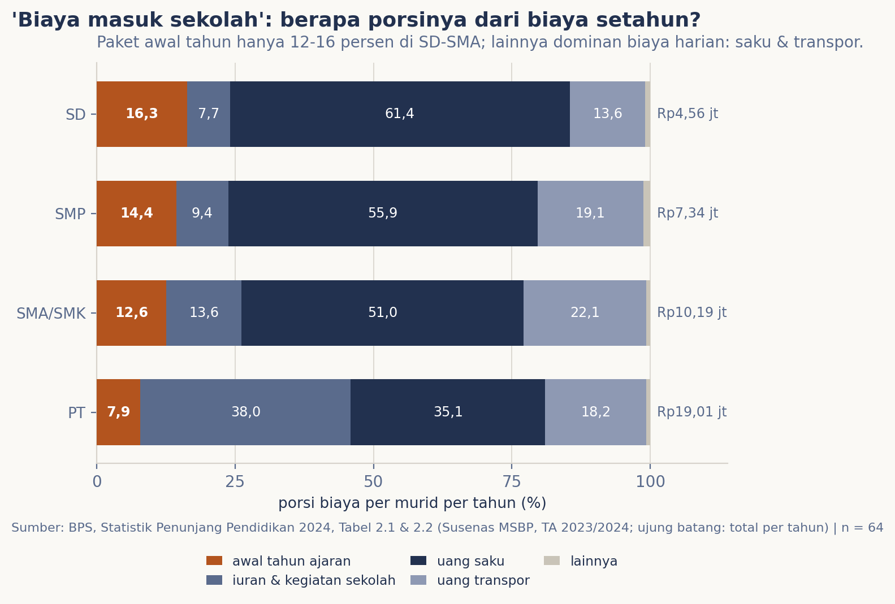
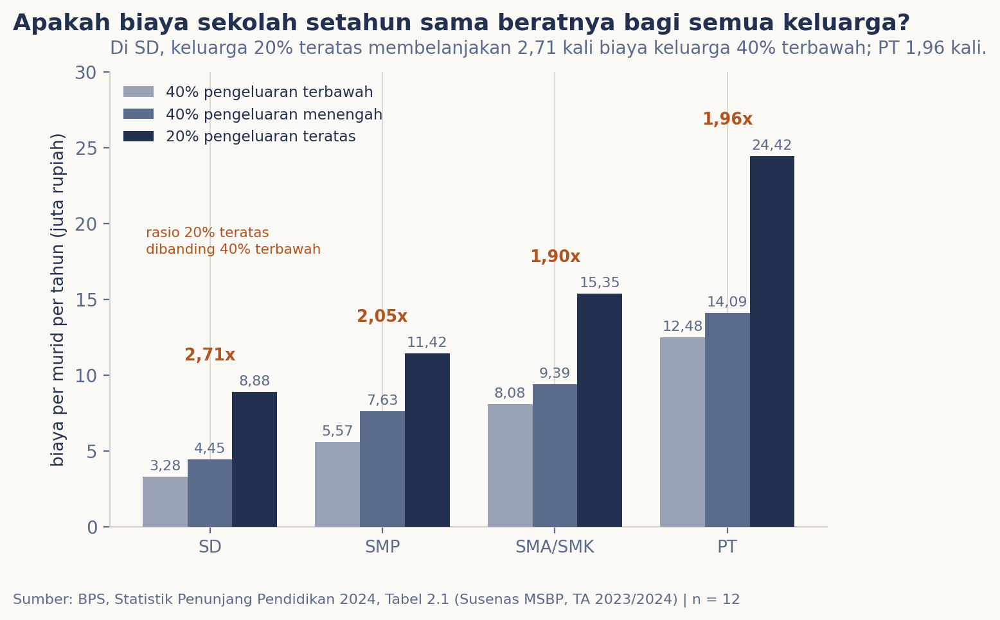

# Biaya masuk sekolah: seberat apa Juli?

## Latar Belakang

Setiap Juli, tahun ajaran baru datang dan percakapan publik kembali dipenuhi satu frasa: *biaya masuk sekolah*. Frasa itu membentuk cara kita membayangkan beban pendidikan sebagai tagihan musiman yang terpusat di muka: uang pangkal, pendaftaran, seragam baru. Sejak 27 Mei 2025 percakapan tersebut juga punya rujukan hukum baru: Putusan MK No. 3/PUU-XXIII/2025 menyatakan jenjang pendidikan dasar wajib diselenggarakan tanpa memungut biaya, baik oleh satuan pemerintah maupun masyarakat [2]. Putusan itu memerlukan potret "sebelum" yang jujur. Edisi ini mengujinya lewat tiga pertanyaan: berapa biaya pendidikan satu tahun ajaran penuh per murid pada tiap jenjang; berapa porsi komponen awal tahun dibandingkan beban yang berjalan tiap hari; dan seberapa timpang bebannya antar kelompok pengeluaran keluarga.

## Data & Metode

Sumber tunggal ialah publikasi BPS "Statistik Penunjang Pendidikan 2024" (Katalog 4301007) [1], hasil Susenas Modul Sosial Budaya dan Pendidikan untuk tahun ajaran 2023/2024. Dua tabel dipakai: Tabel 2.1, rerata total biaya per murid per tahun menurut karakteristik kali empat jenjang (SD, SMP, SMA/SMK, perguruan tinggi); dan Tabel 2.2, proporsi enam belas komponen biaya menurut jenjang. Keduanya diekstrak terprogram dari PDF (perintahnya di `tools/data_scraping.py`) dengan sahakan nilai per sel dan uji jumlah kolom, sebab tanda air dokumen sesekali menempel pada angka. Enam belas komponen dirangkum ke lima golongan yang didefinisikan di muka: awal tahun ajaran (pendaftaran, seragam, buku, LKS, alat tulis), iuran dan kegiatan sekolah (SPP/UKT, komite, dan kegiatan), uang saku, uang transpor, dan lainnya. Terjemahan rupiah dihitung sebagai porsi dikali total rerata per jenjang: taksiran komposit atas rerata nasional, bukan tagihan keluarga tertentu. Galat contoh telah diterbitkan BPS pada Tabel 2.13 s.d. 2.16 publikasi yang sama [1]; edisi ini tidak menghitungnya ulang dan hanya membaca beda yang besarnya orde faktor.

## Hasil

Rerata nasional satu tahun ajaran penuh adalah Rp4,56 juta (SD), Rp7,34 juta (SMP), Rp10,19 juta (SMA/SMK), dan Rp19,01 juta untuk perguruan tinggi; lompatan tiap jenjang kira-kira 1,6; 1,4; dan 1,9 kali lipat.

Gambar 1 membaca struktur beban. Yang lazim disebut "biaya masuk" ternyata sempit: uang pendaftaran 2,13-5,05 persen, dan seluruh paket awal tahun 16,34 persen (SD), 14,38 (SMP), 12,57 (SMA/SMK), hanya 7,88 di perguruan tinggi. Yang menelan bagian terbesar adalah konsumsi harian sekolah: uang saku 61,44 persen di SD (taksiran Rp233 ribu per bulan) ditambah transport 13,60 persen, sehingga keduanya menjangkau 75,04 persen di SD, 74,97 di SMP, dan 73,09 di SMA/SMK. Struktur berubah total di jenjang tertinggi: SPP/UKT 33,47 persen, taksiran Rp6,36 juta setahun; blok iuran dan kegiatan mencapai 38,01 persen.

Gambar 2 membaca keadilannya. Pada jenjang SD, keluarga 20 persen berpengeluaran teratas membelanjakan 2,71 kali lipat biaya keluarga 40 persen terbawah (Rp8,88 lawan Rp3,28 juta setahun); rasio menurun ke 2,05 (SMP), 1,90 (SMA/SMK), dan 1,96 di perguruan tinggi. Jurang kota-desa membuka lebar di SD (1,59 kali), menyempit di SMA/SMK (1,18), dan kembali 1,33 di perguruan tinggi.

## Pembahasan

Dua pembacaan mengoreksi frasa "biaya masuk sekolah". Pertama, beban terbesar keluarga bukanlah membayar sekali di depan, melainkan menahan pengeluaran kecil yang berulang dua ratus hari sekolah. Papan pengganti SPP dan komite di SD hanya 7,70 persen dari beban (taksiran Rp0,27 juta setahun, sekitar Rp23 ribu per bulan), sementara jajan dan ongkos ditahan tiap hari. Selogan "sekolah gratis", termasuk yang dijanjikan Putusan MK No. 3/PUU-XXIII/2025, menyasar blok yang paling sempit itu; tiga per empat beban SD-SMA berada di luar jangkauannya. Kedua, kesenjangan paling lebar justru ada di jenjang yang seharusnya paling ringan; dan rasio yang menurun ke jenjang lebih tinggi bisa dibaca ganda: biaya naik pada semua kelompok, tetapi tabel ini juga hanya merekam keluarga yang anaknya berhasil bersekolah di jenjang tersebut.

Karena data ini dibekukan pada tahun ajaran 2023/2024, tepat sebelum putusan diucapkan, edisi ini bekerja sebagai garis pangkal. Susenas MSBP bersiklus tiga tahunan; edisi yang kelak memuat tahun ajaran sesudah 2025 akan menguji prediksi terukurnya: porsi pendaftaran, SPP, dan komite seharusnya mendekati nol di SD-SMP, sementara uang saku dan transport seharusnya tidak bergeser sistematis sesuai jangkauan putusan.

## Batasan

Angka MSBP adalah pelaporan responden atas biaya satu tahun ajaran, bukan pembukuan; bias ingatan pada komponen kecil wajar diasumsikan. Rerata nasional tidak membedakan negeri-swasta dan wilayah, padahal publikasi sumber menunjukkan bedanya substansial. Definisi "awal tahun" di sini adalah operasionalisasi atas komponen BPS; komponen bernama lain pada praktik sekolah tertentu belum tentu terpetakan rapi. Terjemahan porsi kali total adalah taksiran komposit, bukan tagihan satu rumah tangga. Perbandingan bersifat deskriptif, bukan uji statistik; dan segala kesimpulan tentang efek putusan berada di luar data ini.

## Kesimpulan

Biaya masuk sekolah riil tetapi sempit: 12-16 persen dari beban setahun di jenjang sekolah. Beban yang menentukan adalah harian, sekitar tiga per empat biaya SD-SMA. Kesenjangan terlebar berada di jenjang termuda. Angka-angka ini berdiri sebagai garis pangkal untuk menguji, pada siklus data berikutnya, apakah kebijakan pendidikan dasar tanpa pungutan benar-benar menghapus blok iuran tanpa pergeseran liar ke komponen lain.