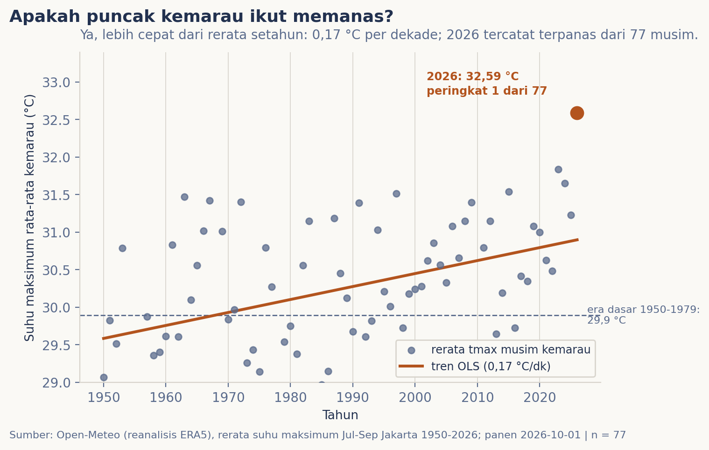
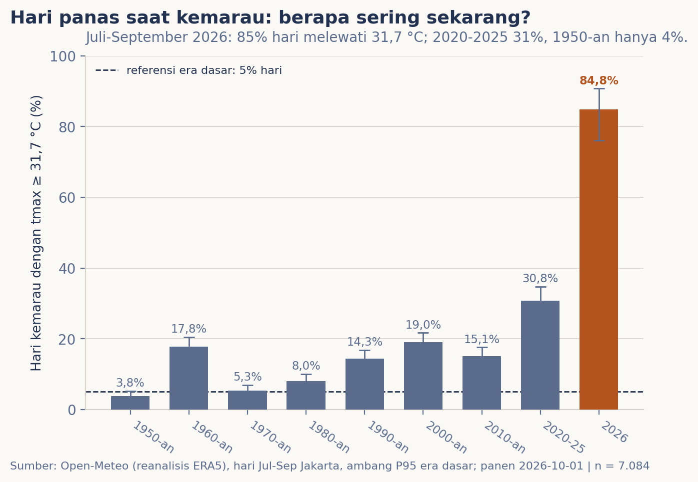

# Panas puncak kemarau, dibandingkan dengan Edisi 001

## Latar Belakang

Edisi pembuka jurnal ini bertanya apakah Jakarta benar makin panas, dan menjawabnya dengan ukuran yang bisa diulang: suhu rata-rata naik 0,16 °C per dekade sejak 1950, dan hari panas (maksimum 31,7 °C ke atas) muncul 3,6 kali lebih sering [3]. Di epilognya tertulis rencana mengulang hitungan dengan tambahan data. Janji itu jatuh tempo, dan sebagaimana pembaruan yang baik, edisi ini tidak langsung menambah angka: ia menguji ulang angka yang lama dari panen yang baru. Setelah fondasinya terbukti kokoh, bidikannya diarahkan ke puncak musim yang menjadi keluhan tahunan, kemarau antara Juli dan September.

## Data & Metode

Kontrak dijaga identik dengan Edisi 001 supaya perbandingannya sah: reanalisis ERA5 lewat Open-Meteo pada titik grid Jakarta Pusat, suhu harian sejak 1950 sampai tanggal panen (1 Oktober 2026; 28.033 hari), dengan pembanding NASA POWER (MERRA-2) sejak 1984 [1][2]. Definisi ukuran juga tidak berubah satu pun: tren OLS dengan selang t, Theil-Sen dan tau Kendall, perbandingan dua jendela dua puluh tahun, ambang persentil ke-95 suhu maksimum era dasar 1950-1979 (31,70 °C), selang Wilson untuk proporsi hari, dan uji proporsi z. Musim kemarau didefinisikan oleh kalender (bulan 7-9); musim 2026 sudah penuh 92 hari pada tanggal panen, dan ukurannya berdiri sendiri tanpa ikut menggeser patokan 1950-2025.

## Hasil

Replikasi berjalan bersih. Kelima belas patokan Edisi 001, dari laju 0,16 °C per dekade sampai pasangan produk POWER 0,19 lawan ERA5 0,31 °C per dekade 1984-2025, terulang persis pada presisi tampilannya; jurnal replikasinya ada di kotak verifikasi notebook.

Dibidik ke musim, pemanasan ternyata tidak merata. Rerata suhu maksimum kemarau naik **0,17 °C per dekade** (Theil-Sen 0,19; lebih cepat dari laju suhu maksimum sepanjang tahun 0,14), atau dari 29,92 °C pada 1950-1969 menjadi 30,76 °C pada 2006-2025 (selisih 0,84; d Cohen 1,02). Era dasar klimatologis 1950-1979 mencatat 29,89 °C. Artinya, bagian tahun yang memang sudah panas memanas sedikit lebih cepat daripada reratannya.

Frekuensinya bergerak lebih tajam lagi. Hari kemarau yang melewati 31,7 °C berjumlah 3,8 persen pada dasawarsa 1950-an; pada 2010-2025 bagian itu sudah 21,0 persen, atau **5,5 kali lebih sering** (selang 95% 3,9-7,8; z = 11,7), melampaui risiko 3,6 kali yang diukur Edisi 001 untuk sepanjang tahun. Potongan enam musim 2020-2025 berdiri di 30,8 persen.

Dan kemudian musim yang berjalan. Kemarau 2026 menutup pada rerata suhu maksimum **32,59 °C**, 2,70 °C di atas era dasar, **peringkat pertama dari 77** musim dalam ERA5, dengan **84,8 persen** harinya melewati ambang panas (78 dari 92 hari; maksimum harian 35,4 °C). Produk pembanding MERRA-2 menempatkan musim yang sama di peringkat lima dari 43, pada 30,26 °C, karena selisih antar produk untuk musim ini membesar ke 2,32 °C (rerata historis 0,79 +/- 0,59). Kedua produk sepakat 2026 lebih panas dari rerata; mereka berselisih pada tingkatnya.

## Pembahasan

Temuan ini terbaca dalam tiga layar. Replikasi adalah fondasi kepercayaan: program yang sama membawa angka yang sama, dan perbandingan lintas edisi berikutnya berdiri di atasnya. Layar musim menjawab mengapa keluhan "panas sekali" terasa membesar pada bulan yang sama tiap tahunnya: puncak kemarau memang bergerak lebih cepat dari rerata, dan ia dimulai dari garis dasar yang sudah tinggi, sehingga frekuensi hari ekstremnya berlipat lebih tajam. Layar tahun berjalan menahan godaan mengumumkan rekor: ERA5 menobatkan 2026, MERRA-2 menaruhnya di lima besar, dan edisi ini melaporkan jangkauannya. Di jurnal yang menyimpan nomor patokan lintas edisi, ini menjadi preseden kerja: ketika dua instrumen berselisih lebih lebar dari biasanya, yang dipublikasikan adalah bedanya. Musim-musim terpanas sebelumnya (1997, 2015, 2023-2024) berbarengan dengan episode El Nino; atribusi 2026 tidak diuji di sini karena berada di luar data yang dipakai.

## Batasan

Data adalah reanalisis berskala kasar pada satu titik grid, bukan termometer stasiun BMKG; catatan kelayakan BMKG dari Edisi 001 tetap berlaku. Definisi kemarau memakai kalender tetap, bukan putaran monsun tiap tahun. Tren bercampur sinyal iklim global, panas kota, dan perubahan tutupan lahan, dan edisi ini tidak mengatribusikannya. MERRA-2 memangkas tiga hari terakhir September 2026 pada tanggal panen; proyek ini belum mempunyai dua musim baru (baru satu, 2026) dibandingkan janji "dua tahun" di epilog Edisi 001, karena 2027 memang belum terekam pada tanggal panen.

## Kesimpulan

Hitungan Edisi 001 bertahan persis, dan dengan satu musim penuh tambahan, bacaannya menajam: puncak kemarau adalah bagian tahun yang memanas paling cepat, hari panas kemaraunya 5,5 kali lebih sering daripada era 1950-an, dan kemarau 2026 tercatat di deret terdepan dari 77 musim menurut ERA5 sekaligus hanya lima besar menurut MERRA-2. Pertanyaan pembuka jurnal ini, "benar makin panas atau kita saja yang mengeluh?", sepanas apapun tahun berikutnya, tetap dijawab ke arah yang sama.

## Referensi

[1] Open-Meteo Historical Weather API (reanalisis ERA5), titik -6,18 / 106,83,
    diakses 1 Oktober 2026.
[2] NASA POWER (MERRA-2), titik sama, diakses 1 Oktober 2026.
[3] Jurnal Eksplorasi Data Keseharian, *Arsip Edisi 001* (patokan limabelas
    ukuran dan catatan kelayakan BMKG), bundel git tag `edisi-001`.
